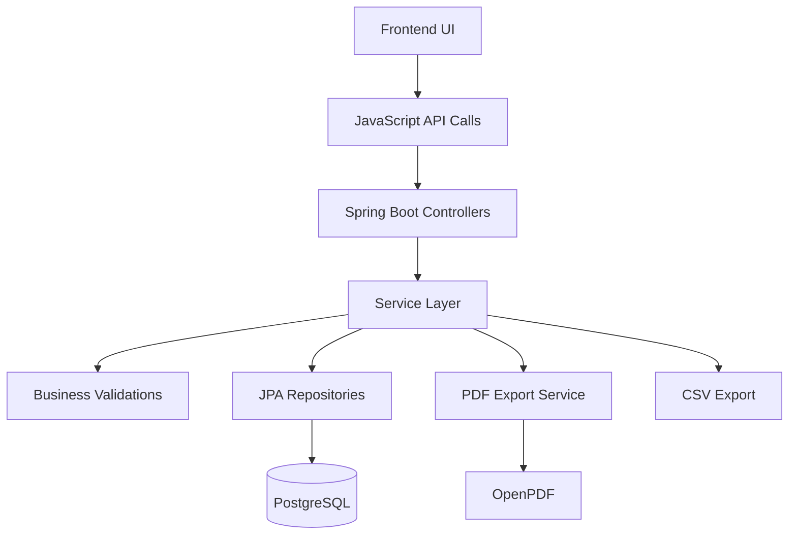
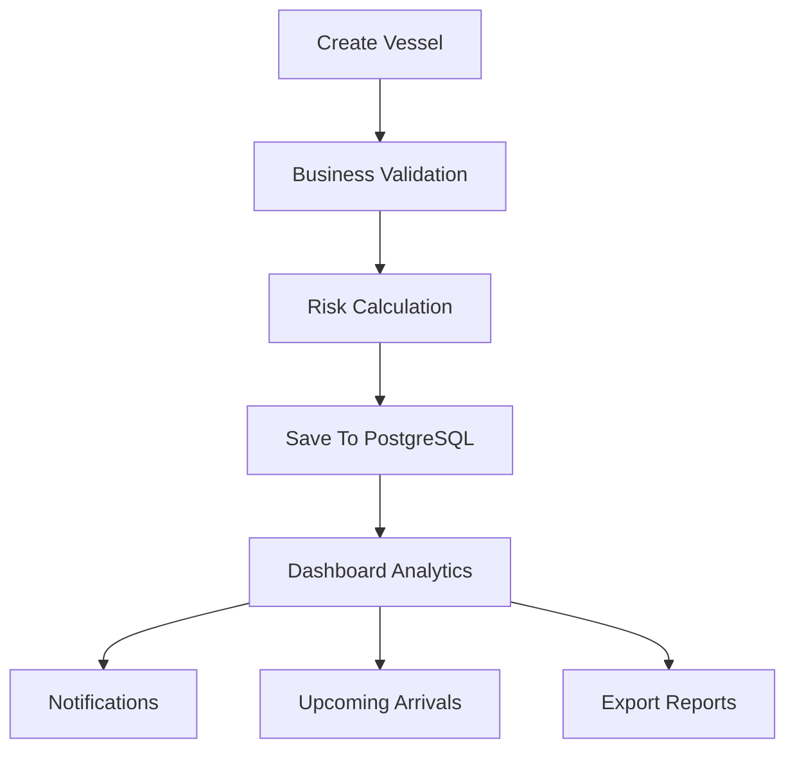
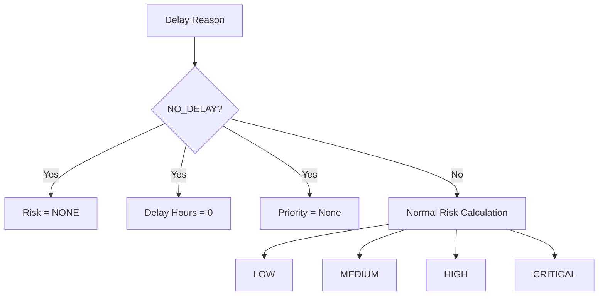
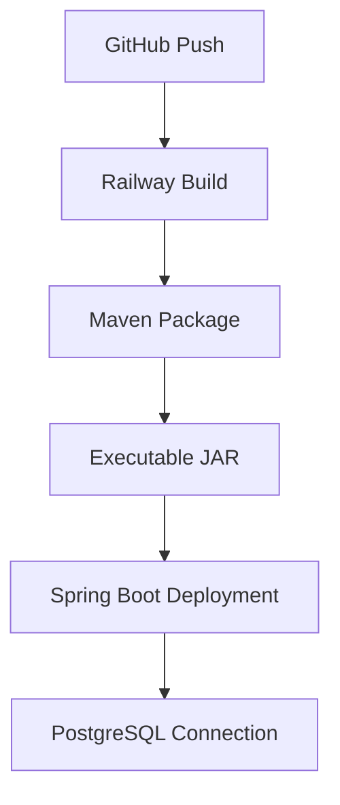
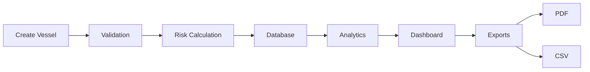

# 🚢 Vessel Risk Management System

A full-stack maritime operations dashboard for monitoring vessel schedules, operational delays, cargo risks, and arrival timelines. The system provides real-time analytics, risk classification, reporting capabilities, and export features through an interactive web dashboard.

---

## 📌 Project Overview

The Vessel Risk Management System helps maritime operators track vessel movements, delays, cargo types, and operational risks through a centralized dashboard.

The application provides:

- Vessel schedule management
- Risk level calculation
- Delay monitoring
- Cargo analytics
- Status tracking
- PDF and CSV report exports
- Responsive dashboard UI
- Dark mode support
- PostgreSQL persistence
- Railway deployment

This project was developed as a practical business-oriented full-stack application using Spring Boot and Vanilla JavaScript.

---

# 🎯 Problem Statement

Maritime operations involve multiple moving vessels, cargo types, delay reasons, and operational risks.

Traditional spreadsheets make it difficult to:

- Monitor delayed vessels
- Identify critical operational risks
- Track incoming arrivals
- Generate reports
- Analyze cargo distribution
- Visualize risk patterns

This system addresses those challenges by providing:

- Centralized vessel management
- Automated risk categorization
- Interactive analytics dashboards
- Exportable operational reports
- Mobile-friendly access

---

# ✨ Features

## Vessel Management

- Create vessel schedules
- Update vessel information
- Delete vessels
- Edit existing records
- View all vessels
- Search vessels by name
- Risk-based filtering

---

## Risk Management

Implemented risk levels:

```text
NONE
LOW
MEDIUM
HIGH
CRITICAL
```

Implemented delay reasons:

```text
NO_DELAY
WEATHER
PORT_CONGESTION
TECHNICAL_ISSUE
CUSTOMS_DELAY
OTHER
```

Implemented cargo types:

```text
GENERAL
FRAGILE
HAZARDOUS
REEFER
```

---

## Analytics Dashboard

The dashboard provides:

### Risk Analytics

- None Risk Count
- Low Risk Count
- Medium Risk Count
- High Risk Count
- Critical Risk Count

### Status Analytics

- Scheduled
- In Transit
- Delayed
- Arrived
- Berthed

### Delay Analytics

- Total Delay Hours
- Average Delay Hours
- Maximum Delay
- Minimum Delay

### Cargo Analytics

- General Cargo
- Hazardous Cargo
- Fragile Cargo
- Reefer Cargo

---

## Notification Center

The system automatically generates notifications for:

### Critical Risk Vessels

```text
🚨 Vessel requires immediate attention
```

### High Risk Vessels

```text
⚠ High operational risk detected
```

### Long Delays

```text
⏰ Delayed by more than 48 hours
```

---

## Upcoming Arrivals

The dashboard displays:

- In-transit vessels
- ETA information
- Upcoming arrivals
- Chronological sorting

---

# 📄 Export Features

## CSV Export

Implemented:

```text
ID
Vessel Name
Risk Level
Priority Level
Delay Hours
Cargo Type
```

Generated file:

```text
vessel-report.csv
```

---

## PDF Export (OpenPDF)

The system generates professional PDF reports including:

### Report Header

```text
Vessel Risk Management Report
```

### Vessel Summary

- Total Vessels
- Generated Timestamp
- System Information

### Vessel Table

```text
ID
Name
Status
Risk Level
```

### Executive Summary

Implemented:

- Total Delay Hours
- Average Delay Hours
- Most Common Risk Level
- Most Common Vessel Status

### Risk Analytics

```text
LOW
MEDIUM
HIGH
CRITICAL
NONE
```

### Status Analytics

```text
SCHEDULED
IN_TRANSIT
DELAYED
ARRIVED
BERTHED
```

---

# 🌙 UI Enhancements

The application includes:

## Responsive Design

Desktop:

```text
Analytics
Notifications
Upcoming Arrivals
Reports
```

Mobile:

```text
Stacked Cards
Responsive Tables
Adaptive Layout
```

---

## Dark Mode

Implemented:

- Maritime-themed dark palette
- Dark forms
- Dark tables
- Dark analytics cards
- Dark notification panels
- Theme toggle support

---

## Additional UI Features

Implemented:

- Toast notifications
- Status badges
- Risk badges
- Search functionality
- Filter pills
- Doughnut chart analytics
- Last export timestamp
- Empty-state handling
- Mobile responsiveness

---

# 🛠 Technology Stack

## Backend

```text
Java 17
Spring Boot 3.5.3
Spring Data JPA
Hibernate
Bean Validation
Lombok
OpenPDF
Maven
```

---

## Frontend

```text
HTML5
CSS3
Vanilla JavaScript
Chart.js
```

---

## Database

```text
PostgreSQL
Railway Cloud Database
```

---

## Deployment

```text
Railway
```

---

# 🏗 System Architecture



---

# 📂 Project Structure

```text
risk-management-own
│
├── src
│   ├── main
│   │   ├── java
│   │   │   └── com.tharun.risk_management
│   │   │
│   │   │   ├── config
│   │   │   ├── controller
│   │   │   ├── dto
│   │   │   ├── entity
│   │   │   ├── enums
│   │   │   ├── exception
│   │   │   ├── repository
│   │   │   └── service
│   │   │
│   │   └── resources
│   │       ├── static
│   │       │   ├── index.html
│   │       │   ├── app.js
│   │       │   ├── style.css
│   │       │   └── theme.css
│   │       │
│   │       └── application.properties
│   │
│   └── test
│
├── pom.xml
└── README.md
```

---

# 🗄 Database Design

The application uses PostgreSQL for persistent data storage.

---

## Vessel Entity

The system revolves around a single core entity:

```text
VesselEntity
```

---

## Vessel Information

The entity stores:

| Field | Description |
|---------|-------------|
| vesselID | Unique identifier |
| vesselName | Name of vessel |
| cargoType | Type of cargo |
| delayReason | Operational delay reason |
| riskLevel | Calculated risk category |
| priorityLevel | Business priority |
| status | Current vessel status |
| delayHours | Delay duration |
| eta | Estimated arrival |
| arrivalDate | Actual arrival |
| departureDate | Departure timestamp |

---

# 🔢 Enumerations

The application uses enums to maintain data consistency.

---

## RiskLevel

```java
NONE
LOW
MEDIUM
HIGH
CRITICAL
```

---

## CargoType

```java
GENERAL
FRAGILE
HAZARDOUS
REEFER
```

---

## DelayReason

```java
NO_DELAY
WEATHER
PORT_CONGESTION
TECHNICAL_ISSUE
CUSTOMS_DELAY
OTHER
```

---

## VesselStatus

```java
SCHEDULED
IN_TRANSIT
DELAYED
ARRIVED
BERTHED
```

---

# ⚙ Business Rules & Validations

The service layer contains the application's business logic and validation rules.

---

## Delay Reason Rules

### No Delay Handling

```text
NO_DELAY

↓

Delay Hours = 0

↓

Risk Level = NONE

↓

Priority Level = None
```

---

## Arrival Date Validation

Arrival date is only applicable for:

```text
ARRIVED
BERTHED
```

Future statuses automatically disable arrival date input.

---

## ETA Validation

ETA is required for:

```text
SCHEDULED
IN_TRANSIT
DELAYED
```

---

## Status Management Rules

Future states:

```text
SCHEDULED
IN_TRANSIT
DELAYED
```

Completed states:

```text
ARRIVED
BERTHED
```

---

## Notification Rules

Notifications are generated when:

### Critical Risk

```text
Risk = CRITICAL
```

---

### High Risk

```text
Risk = HIGH
```

---

### Long Delays

```text
Delay Hours > 48
```

---

# 🚀 REST API Documentation

Base URL:

```text
/api/vessels
```

---

# Create Vessel

```http
POST /api/vessels
```

Creates a new vessel schedule.

---

### Sample Request

```json
{
    "vesselName": "Ocean Titan",
    "cargoType": "GENERAL",
    "delayReason": "WEATHER",
    "status": "IN_TRANSIT",
    "eta": "2026-07-10T12:00"
}
```

---

# Get All Vessels

```http
GET /api/vessels
```

Returns all vessel records.

---

# Get Vessel By ID

```http
GET /api/vessels/{id}
```

Returns a specific vessel.

---

# Update Vessel

```http
PUT /api/vessels/{id}
```

Updates existing vessel information.

---

### Sample Request

```json
{
    "vesselName": "Ocean Titan Updated",
    "cargoType": "REEFER",
    "delayReason": "NO_DELAY",
    "status": "ARRIVED",
    "arrivalDate": "2026-07-12T10:30",
    "departureDate": "2026-07-13T18:00"
}
```

---

# Delete Vessel

```http
DELETE /api/vessels/{id}
```

Removes a vessel record.

---

# Export PDF

```http
GET /api/vessels/export/pdf
```

Generates a downloadable PDF report.

Generated file:

```text
vessel-report.pdf
```

---

# CSV Export

CSV export is implemented on the frontend using JavaScript.

Generated file:

```text
vessel-report.csv
```

---

# 📊 Dashboard Analytics

The system provides multiple analytical modules.

---

## Risk Distribution

Implemented using:

```text
Chart.js Doughnut Chart
```

Categories:

```text
LOW
MEDIUM
HIGH
CRITICAL
```

---

## Delay Analytics

Metrics:

```text
Total Delay Hours
Average Delay Hours
Maximum Delay
Minimum Delay
```

---

## Cargo Analytics

Supported:

```text
GENERAL
HAZARDOUS
FRAGILE
REEFER
```

---

## Status Analytics

Supported:

```text
SCHEDULED
IN_TRANSIT
DELAYED
ARRIVED
BERTHED
```

---

# 🔔 Notification System

The dashboard automatically generates:

```text
🚨 Critical Risk Alerts

⚠ High Risk Alerts

⏰ Long Delay Alerts
```

---

# 🚢 Upcoming Arrivals

Features:

```text
Filter:

Status = IN_TRANSIT

↓

Sort by ETA

↓

Display Top 5 Upcoming Arrivals
```

---

# 📈 System Workflow



---

# 🔄 Risk Processing Workflow



---

# ⚠ Exception Handling

The application implements centralized exception handling to provide meaningful error messages and maintain API consistency.

---

## Global Exception Handling

The system uses:

```text
GlobalExceptionHandler
```

to handle runtime exceptions across the application.

---

## Supported Exceptions

### Resource Not Found

Used when:

```text
GET /api/vessels/{id}

↓

Invalid ID
```

Example:

```json
{
    "message": "Vessel not found"
}
```

---

### Business Validation Errors

Used for:

```text
Invalid Status

Invalid Date Combinations

Business Rule Violations
```

---

### Generic Exception Handling

Unexpected runtime errors are converted into user-friendly API responses.

---

# 📄 Report Export System

The application supports multiple export formats.

---

# CSV Export

CSV export is implemented on the frontend.

---

## Exported Fields

```text
ID
Vessel Name
Risk Level
Priority Level
Delay Hours
Cargo Type
```

---

## Generated File

```text
vessel-report.csv
```

---

# PDF Export

PDF reports are generated using:

```text
OpenPDF
```

---

## PDF Contents

### Report Header

```text
Vessel Risk Management Report
```

---

### Generated Information

```text
Date & Time

System Information
```

---

### Vessel Table

```text
ID
Name
Status
Risk Level
```

---

### Executive Summary

Generated metrics:

```text
Total Delay Hours

Average Delay Hours

Most Common Risk Level

Most Common Vessel Status
```

---

### Risk Analytics

```text
NONE

LOW

MEDIUM

HIGH

CRITICAL
```

---

### Status Analytics

```text
SCHEDULED

IN_TRANSIT

DELAYED

ARRIVED

BERTHED
```

---

# 🎨 User Interface Design

The frontend focuses on usability and operational visibility.

---

# Dashboard Components

The system contains:

```text
Top Analytics Cards

Risk Distribution Chart

Notifications Panel

Upcoming Arrivals

Delay Analytics

Cargo Analytics

Reports & Export Center
```

---

# Risk Badges

Implemented badge colors:

| Risk | Color |
|--------|---------|
| NONE | Gray |
| LOW | Green |
| MEDIUM | Yellow |
| HIGH | Orange |
| CRITICAL | Red |

---

# Status Badges

Supported statuses:

```text
SCHEDULED

IN TRANSIT

DELAYED

ARRIVED

BERTHED
```

---

# Toast Notifications

The UI provides:

```text
Success Messages

Warning Messages

Error Messages
```

Examples:

```text
✅ Vessel created successfully

🗑 Vessel deleted successfully

❌ Failed to save vessel
```

---

# 🌙 Dark Mode

The application supports:

```text
Dark Dashboard

Dark Tables

Dark Forms

Dark Analytics Cards

Dark Notifications

Dark Reports Section
```

---

# 📱 Responsive Design

The UI is optimized for:

```text
Desktop

Tablet

Mobile
```

---

## Desktop Layout

```text
Analytics Cards

↓

Risk Chart + Delay Analytics

↓

Notifications + Upcoming Arrivals

↓

Reports & Export Center
```

---

## Mobile Layout

Components automatically stack vertically:

```text
Analytics

↓

Notifications

↓

Upcoming Arrivals

↓

Reports
```

---

# 🚀 Getting Started

---

# Prerequisites

Install:

```text
Java 17

Maven

PostgreSQL
```

---

# Clone Repository

```bash
git clone https://github.com/tharunofficerust-del/vessel-risk-management-own.git

cd vessel-risk-management-own
```

---

# Configure Database

Update:

```properties
application.properties
```

Example:

```properties
spring.datasource.url=

spring.datasource.username=

spring.datasource.password=
```

---

# Install Dependencies

```bash
mvn clean install
```

Skip tests:

```bash
mvn clean install -DskipTests
```

---

# Run Application

```bash
mvn spring-boot:run
```

Application:

```text
http://localhost:8080
```

---

# Build Executable JAR

```bash
mvn clean package
```

Generated:

```text
target/

risk-management.jar
```

Run:

```bash
java -jar target/risk-management.jar
```

---

# ☁ Deployment

The project is deployed using:

```text
Railway
```

---

# Production Stack

```text
Frontend

↓

Spring Boot

↓

PostgreSQL (Railway)

↓

OpenPDF Reports
```

---

# Deployment Workflow



---

# 🧪 Manual Testing

The project was tested for:

---

## CRUD Operations

```text
Create Vessel

Read Vessel

Update Vessel

Delete Vessel
```

---

## Business Rules

```text
NO_DELAY Validation

Arrival Date Validation

Status Handling

Risk Calculation
```

---

## Dashboard Features

```text
Risk Analytics

Delay Analytics

Cargo Analytics

Notifications

Upcoming Arrivals
```

---

## Export Features

```text
CSV Export

PDF Export
```

---

## UI Features

```text
Dark Mode

Responsive Layout

Search

Risk Filters

Toast Notifications
```

---

# 🔮 Future Improvements

The following features are planned for future versions and are NOT currently implemented:

```text
React Frontend Migration

Authentication & Authorization

Role-Based Access Control

Real-Time Notifications

Advanced PDF Charts

Historical Analytics
```

---

# 📸 Screenshots

Add project screenshots here:

```text
Dashboard (Light Mode)


Dashboard (Dark Mode)


PDF Report


Mobile View


Analytics Dashboard & Export Center


```

---

# 👨‍💻 Author

**Tharun Vijay**

B.Sc Computer Science (2025)

Java Full Stack Developer

Portfolio:

```text
https://tharunvijay.vercel.app
```

---

# 🙏 Acknowledgements

Libraries and tools used:

```text
Spring Boot

Spring Data JPA

PostgreSQL

OpenPDF

Chart.js

Lombok

Railway

Maven
```

---

# 📄 License

This project is intended for educational and portfolio purposes.

---

# ⭐ Project Status

```text
Version:

V1.0 COMPLETE

Status:

Production Ready

Deployment:

Railway

Database:

PostgreSQL

Reports:

CSV + PDF Supported
```

---


